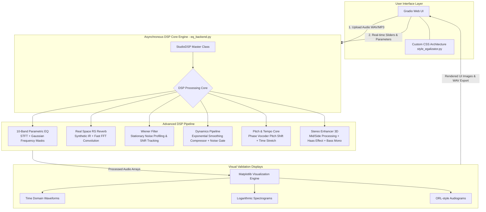

# 🎛️ Studio EQ Pro - Hybrid Desktop Audio Player Architecture

This repository contains the complete implementation of an interactive Digital Audio Workstation (DAW) ecosystem designed as a lightweight, non-blocking desktop application using Python and Gradio.

The project bridges the gap between theoretical digital signal processing (DSP) algorithms and real-time studio software. It transforms advanced mathematical operations from offline scripts into a responsive, production-ready audio tool.

The system architecture is inspired by the foundational concepts of [Audio-Equalizer by Ahmed-Hajhamed](https://github.com/Ahmed-Hajhamed/Audio-Equalizer), but has been entirely rewritten, modernized, and significantly extended to feature a complete Frontend/Backend separation, a custom-engineered CSS interface, and professional-grade mastering and spatialization pipelines.

<div align="center">
  
</div>

---

# ⚙️ System Architecture & Data Flow

The primary engineering goal of **Studio EQ Pro** is to maintain a completely non-blocking, fluid user experience. To achieve this, the system completely decouples the user interface from the heavy mathematical processing core.

While the custom Frontend handles user input, parameters, and display updates, the asynchronous Backend engine executes deep matrix manipulations, Fourier transforms, and fast convolutions in the background via **Librosa** and **SciPy**.

## Block Diagram



---

# ✨ Comprehensive Feature Set

## 1. 10-Band Parametric Equalizer

### Mathematical Core
Utilizes the Short-Time Fourier Transform (STFT) to map time-domain audio signals into the complex frequency domain.

### Gaussian Filtering
Unlike basic brick-wall filters that induce phase distortion and ringing artifacts, this module applies a continuous bell-curve mask (Gaussian distribution) across the target frequencies (31.5 Hz to 16 kHz). This guarantees ultra-smooth spectral transitions and a pristine, natural sound signature.

---

## 2. Real Space (RS) Reverb

### Acoustic Simulation
Emulates real physical spaces (Room, Hall, Chamber, Plate, Cathedral) by generating high-fidelity synthetic Impulse Responses (IR).

### Algorithm
A white noise vector is modulated by a steep, mathematically computed exponential decay envelope matching the selected room's acoustic properties. The raw signal is then processed using Fast Convolution (`scipy.signal.fftconvolve`), optimizing execution speed significantly compared to standard time-domain convolution algorithms.

---

## 3. Wiener Filter & Noise Reduction

### Stationary De-noising
Specifically engineered to combat constant background disturbances such as microphone hiss, system fan noise, or pre-amplifier hum.

### Spectral Tracking
Analyzes the stationary noise floor of the signal, tracks the Signal-to-Noise Ratio (SNR) across individual frequency bins, and subtracts the estimated noise components without introducing musical noise or phase errors.

---

## 4. Dynamics & Mastering (Compressor + Gate)

### Noise Gate
Automatically silences audio sections that drop below a configurable decibel threshold, completely cleansing vocal pauses of ambient artifacts.

### Audio Compressor
Limits high-amplitude transients to achieve a balanced, commercially competitive dynamic range. The compression envelope is driven by exponential smoothing equations governing the automatic Attack (10 ms) and Release (200 ms) curves, preventing digital clipping or sudden volume pumping.

---

## 5. Pitch, Tempo & Echo Engineering

### Independent Manipulation
Allows independent tuning of fundamental frequency (Pitch Shifting) and duration (Time Stretching) without cross-contamination, using a high-quality phase vocoder mechanism.

### Delay Pipeline
Includes an echo module capable of generating recurring, rhythmically clean signal reflections with configurable feedback loops and smooth volume attenuation curves.

---

## 6. Stereo Enhancer (3D Spatial Audio)

### Haas Effect
Widens the perception of the soundstage by creating a precise 15 ms delay vector mapped directly onto the side channel.

### Mid/Side Processing
Separates center mix components from the extreme stereo field.

### Bass Mono Integration
A critical mixing utility that actively intercepts all frequencies below 120 Hz and forces them into a strict mono configuration. This prevents low-frequency phase cancellation, ensuring consistent low-end punch across mono systems, club PAs, and mobile devices.

---

## 7. Interactive Visual Validation

Provides immediate, production-grade visual feedback computed directly from the processed numeric arrays:

### Waveforms
High-resolution rendering of signal amplitude over time.

### Logarithmic Spectrograms
Displays energy distribution matching human auditory perception curves.

### Audiograms
Simulates clinical ORL diagnostic charts, plotting absolute signal intensity across standard reference bands.

---

# 🚀 Installation, Setup, and Execution

To run Studio EQ Pro locally on your machine, follow these structured steps:

## 1. Clone the Repository

```bash
git clone https://github.com/gavmada26/Studio-EQ-Pro.git
cd Studio-EQ-Pro
```

## 2. Setup the Virtual Environment

It is highly recommended to isolate the dependencies using a clean virtual environment.

```bash
# Create the virtual environment
python -m venv venv

# Activate the environment

# Windows (Command Prompt / PowerShell)
venv\Scripts\activate

# macOS / Linux
source venv/bin/activate
```

## 3. Install Package Dependencies

```bash
pip install --upgrade pip
pip install -r requirements.txt
```

## 4. Launch the DAW Ecosystem

```bash
python src/egalizator_gradio.py
```

Upon initialization, the terminal will confirm the active server link.

Open:

```text
http://127.0.0.1:7860
```

---

# 🎓 Academic Context

**Author:** Mădălin GAVRILAȘ  
**Group:** TST-RO – 2242/2

**Institution:** Technical University of Cluj-Napoca (UTCN), Romania

**Faculty:** Faculty of Electronics, Telecommunications and Information Technology (ETTI)

**Project Coordinator:** Assoc. Prof. Dr. Eng. Simina EMERICH

**Academic Year:** 2026
